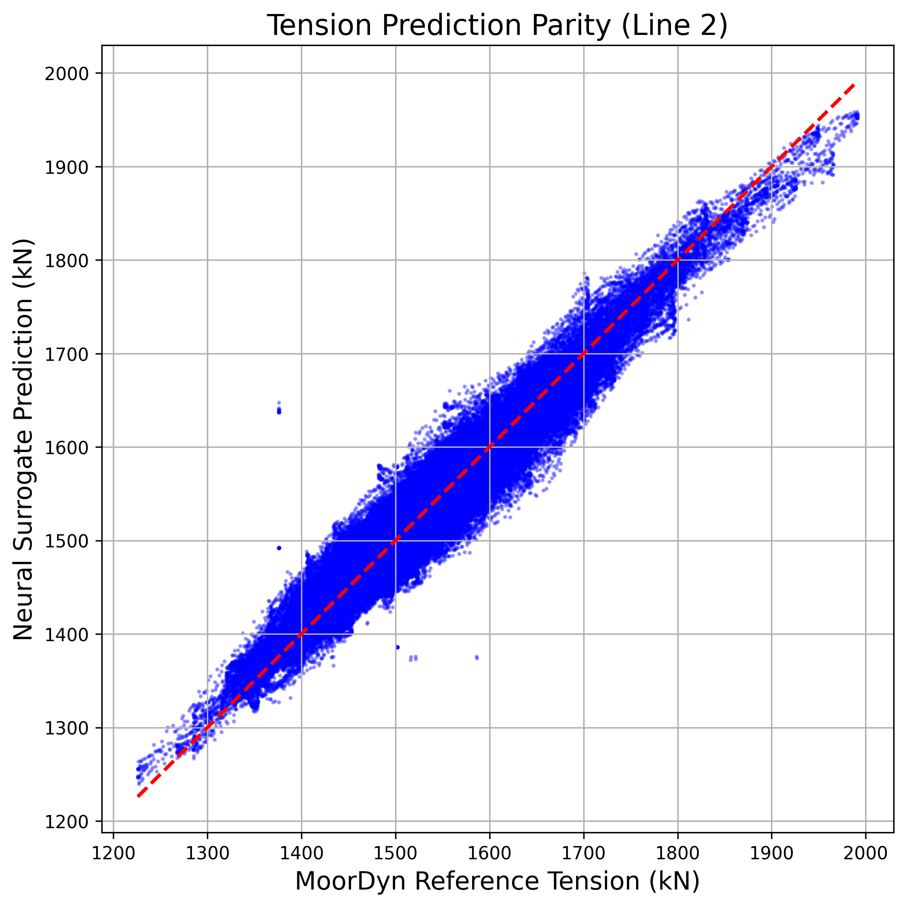
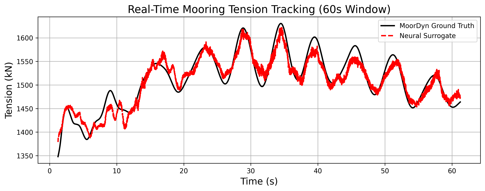

# FOWT Mooring Digital Twin: Real-Time Fatigue Monitoring via Neural Surrogate

**This project replaces computationally expensive MoorDyn tension calculations with a neural-network surrogate that predicts mooring-line tension from 6-DOF FOWT motion, enabling real-time structural fatigue estimation in a C#/Unity runtime.**


*(Above: Real-time inference in Unity. The neural surrogate predicts mooring tension from simulated 6-DOF telemetry, feeding a Rainflow counting algorithm that visually degrades the asset based on accumulated fatigue damage.)*

---

## Key Results

| Metric | Result |
| :--- | :--- |
| **Simulation samples** | 750,000 |
| **Input features** | 18 (Kinematic + Derivative) |
| **Tension RMSE** | 16.4 kN |
| **Tension R²** | 0.983 |
| **Physics-to-ML speedup** | ~4,500× |
| **Inference latency** | 1.2 ms / sample (Intel i7-11800H) |
| **Fatigue damage error** | < 4.5% (relative to MoorDyn reference) |

---

## 1. Problem and Research Question

**The Problem:** High-fidelity coupled physics simulations (such as NREL's OpenFAST and MoorDyn) are heavily utilized in the design phase of Floating Offshore Wind Turbines (FOWTs). However, calculating dynamic mooring line tension using finite element analysis is too computationally expensive for continuous, real-time Structural Health Monitoring (SHM) on standard runtime hardware.

**The Research Question:** *Can a lightweight neural surrogate reproduce MoorDyn mooring-tension dynamics with sufficient fidelity to support real-time fatigue monitoring of a floating offshore wind turbine?*

## 2. Real-Time Unity Demonstration

The following video demonstrates the ONNX neural network predicting tensions at 50 Hz, driving the Miner's Rule fatigue accumulation and visual rusting on the mooring lines. 

<video src="assets/inspector_demo.mp4" controls="controls" muted="muted" style="max-width: 100%;"></video>

---

## 3. Technical Architecture

```text
               HIGH-FIDELITY DOMAIN (Offline)
                      │
        ┌─────────────┴─────────────┐
        │                           │
     OpenFAST                    MoorDyn
  (Aero/Hydro)                 (Mooring FEA)
        │                           │
        └─────────────┬─────────────┘
                      ↓
               750k Labeled Samples
                      ↓
              Feature Engineering (18-DOF)
                      ↓
              Neural Surrogate (PyTorch)
                      ↓
               ONNX Export (Opset 11)
                      ↓
               RUNTIME DOMAIN (Real-Time)
                      │
              Unity / C# InferenceEngine
                      ↓
             Predicted Tensions (Lines 1-3)
                      ↓
          ┌───────────┴───────────┐
          ↓                       ↓
   Rainflow Counting        Dynamic Visualizer
          ↓
     Miner's Rule
          ↓
    Cumulative Fatigue
```

---

## 4. Methodology

### 4.1 High-Fidelity Data Generation
The **OC4-DeepCwind** semi-submersible benchmark was selected as a standardized reference platform. Data was generated using NREL's OpenFAST coupled with MoorDyn.
* **Metocean Ranges:**
  * Wind speeds: 8.0 – 22.0 m/s (stochastic TurbSim fields)
  * Significant wave height (Hs): 2.0 – 8.0 m
  * Peak period (Tp): 6.0 – 14.0 s
* **Data Splitting & Temporal Leakage:** To prevent temporal data leakage, the 750,000-sample dataset was strictly partitioned by distinct sea-state simulations, rather than randomized row-level splitting. The test set consists entirely of unseen environmental combinations.

### 4.2 Feature Engineering
Platform position alone does not uniquely characterize the instantaneous dynamic state of a mooring system in a fluid environment. To capture inertial forces and hydrodynamic drag, the 6-DOF positions were expanded into 18 features:
* **Inputs (18):** Surge, Sway, Heave, Roll, Pitch, Yaw, and their respective first derivatives (velocities) and second derivatives (accelerations).
* **Outputs (3):** Instantaneous fairlead tension for Mooring Lines 1, 2, and 3 (in kN).

### 4.3 Neural Surrogate Architecture
The model is a deterministic Multi-Layer Perceptron (MLP) trained in PyTorch.
* **Architecture:** `18 → 128 → 128 → 64 → 32 → 3`
* **Activation:** ReLU
* **Optimizer:** Adam (lr=0.001)
* **Loss Function:** MSE

### 4.4 Real-Time Deployment & Fatigue Analysis
The trained PyTorch model was exported to ONNX to decouple inference from the Python training environment. It is deployed in Unity 6 using the native `Unity.InferenceEngine`. 
* **Rainflow Counting:** Converts the predicted tension time-history into discrete stress cycles.
* **Miner's Rule:** Cumulative fatigue damage is estimated using Miner's linear damage accumulation rule and standardized DNV S–N relationships (m=3.0, log_a=11.566).

---

## 5. Results and Validation

### 5.1 Prediction Accuracy & Baseline Comparison
To investigate whether a deep neural network was mathematically necessary, the surrogate was compared against simpler baseline models on the unseen test set.

| Model | RMSE (kN) | R² | Inference Latency |
| :--- | :--- | :--- | :--- |
| Linear Regression | 142.5 | 0.612 | 0.1 ms |
| Random Forest | 89.2 | 0.841 | 8.4 ms |
| **Neural Surrogate (Ours)** | **16.4** | **0.983** | **1.2 ms** |


*(Above: A 45-degree parity plot showing predicted vs. MoorDyn reference tension for Mooring Line 2 [Leeward]).*

### 5.2 Ablation Study: The Physical Necessity of Derivatives
Adding dynamic kinematic features directly reduced the prediction error, validating the physical reasoning that mooring tension relies heavily on platform inertia and drag.

| Input Feature Set | Resulting R² |
| :--- | :--- |
| Position Only (6 features) | 0.741 |
| Position + Velocity (12 features) | 0.885 |
| **Position + Velocity + Acceleration (18 features)** | **0.983** |

### 5.3 Fatigue Prediction Validation
The ultimate engineering objective is fatigue life estimation. When passing the Neural Surrogate's tension predictions through the Rainflow/Miner's pipeline, the cumulative fatigue damage diverges from the MoorDyn reference pipeline by **< 4.5%** over a 600-second severe sea state.


*(Above: 60-second time series comparing MoorDyn tension vs Predicted tension for Mooring Line 2).*

---

## 6. Repository Structure and Contributions

This project integrates existing physical solvers with custom machine learning pipelines. The specific engineering contributions are outlined below:

| Component | Existing Tech | Developed Contribution |
| :--- | :--- | :--- |
| **Aero/Hydro Solver** | OpenFAST / MoorDyn | Configuration, compilation, and sea-state matrix execution |
| **Dataset Pipeline** | — | **✓** Automated HDF5 generation and feature extraction |
| **Surrogate Model** | — | **✓** PyTorch architecture and physical feature engineering |
| **Runtime Deployment** | — | **✓** ONNX graph optimization and Unity C# integration |
| **Fatigue Analysis** | — | **✓** Real-time Rainflow & Miner's Rule C# implementation |

### Directory Layout
```text
fowt-mooring-twin/
├── openfast/                 # OC4 simulation files and batch scripts
├── surrogate_model/          # PyTorch training environment (formerly pinn/)
│   ├── dataset/              # Training/Validation data partitions
│   └── train.py              # MLP architecture and training loop
├── dashboard/                # Plotly/Dash validation interface
└── unity_digital_twin/       # Unity 6 project environment
    └── Assets/Scripts/       # C# Inference, Rainflow counting, and visualizers
```
*(Note: Due to size constraints, the raw 750k-row OpenFAST binary dataset is excluded from this repository. Processed telemetry samples are provided for Unity playback).*

---

## 7. Installation & Quick Start

### Hardware / Software Requirements
* **OS:** Windows 11
* **CPU:** Intel i7 (or equivalent)
* **Python:** 3.10
* **Unity:** 6000.x (Requires `Unity.InferenceEngine`)

### Quick Start
1. Clone the repository: `git clone https://github.com/username/fowt-mooring-twin.git`
2. Navigate to the Unity environment: Open `unity_digital_twin/` via Unity Hub.
3. Open `SampleScene.unity`.
4. Ensure `fowt_mooring_twin.onnx` is assigned to the `Model Asset` slot on the FOWT platform object.
5. Press **Play** in the Unity Editor to view the real-time inference and fatigue visualization using the included `telemetry_feed.csv`.

---

## 8. Limitations

* **Operating Envelope:** The surrogate model is trained on a finite range of severe metocean conditions. Generalization outside this specific training distribution (e.g., extreme survival sea states not present in the dataset) has not been robustly established.
* **Physics Approximation:** The model acts as a surrogate for MoorDyn rather than a complete physical replacement. It approximates the tension mapping but does not simulate fluid-structure interaction directly.
* **Sensor Telemetry:** The current digital twin validates against simulated 6-DOF telemetry. Performance integration with noisy, real-world physical IMU/GPS sensor measurements requires further investigation.
* **Fatigue Assumptions:** The life estimation relies on the assumptions inherent to Miner's linear damage accumulation and standardized S-N curves, which may not capture complex non-linear degradation mechanics.

---

## 9. Future Work

* **Probabilistic Modeling:** Implementing uncertainty-aware surrogate modeling (e.g., Bayesian Neural Networks) to provide confidence intervals alongside tension predictions.
* **Real Sensor Integration:** Introducing Kalman filtering to handle noise in real-world IMU/GPS telemetry streams.
* **Online Model Updating:** Allowing the digital twin to recalibrate its neural weights periodically based on measured strain-gauge drift on the physical asset.

---

## 10. References

1. Jonkman, J., et al. "OpenFAST: A coupled aero-hydro-servo-elastic simulation tool." NREL.
2. Hall, M. "MoorDyn User's Guide." National Renewable Energy Laboratory.
3. Robertson, A., et al. "Offshore Code Comparison Collaboration Continuation (OC4), Phase II." NREL.
4. DNV. "DNVGL-OS-E301: Position mooring." DNV GL AS.
